# Firewall Basics

*please see attatched packet tracer file if you are confused at any point*

A firewall is a crucial network security device that acts as a barrier between a trusted internal network and untrusted external networks, such as the internet. It monitors and controls incoming and outgoing network traffic based on predefined security rules, aiming to prevent unauthorized access, data breaches, and malicious activities. Firewalls can be implemented in hardware, software, or virtual form and play a pivotal role in enforcing network security policies, filtering traffic, and protecting sensitive information from cyber threats.

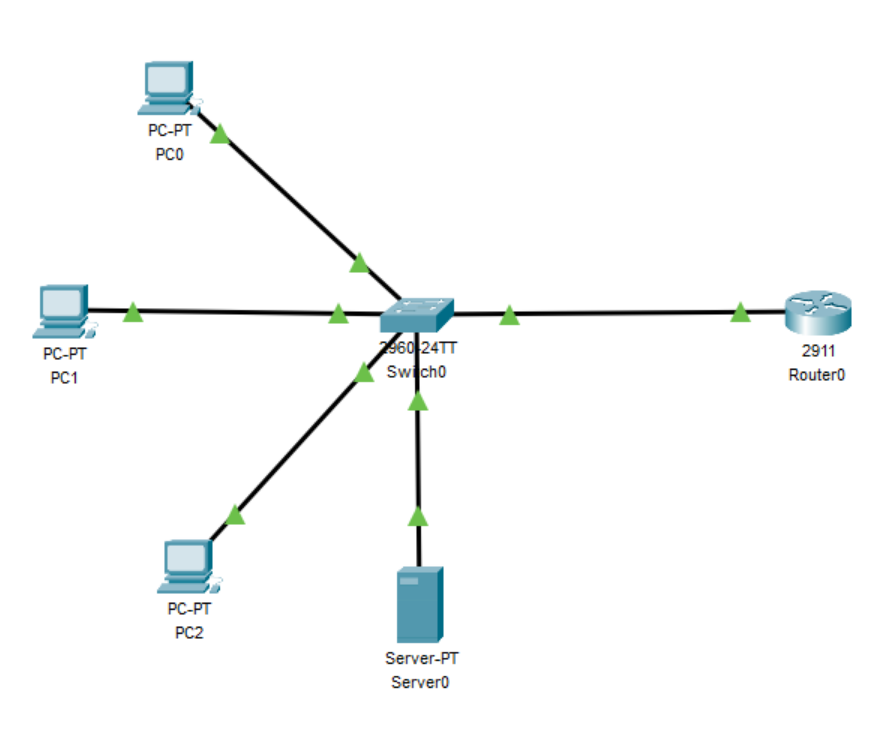

## Consider this network topology, How do we secure the PC’s from unauthorized external attacks from the internet?

### Setting up the topology

1. Place the objects as shown.
2. Configure the servers IP address.

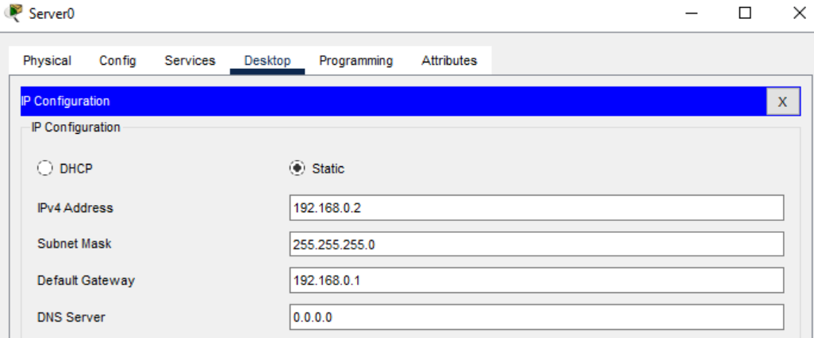

3. Configure DHCP Service on the server as shown.

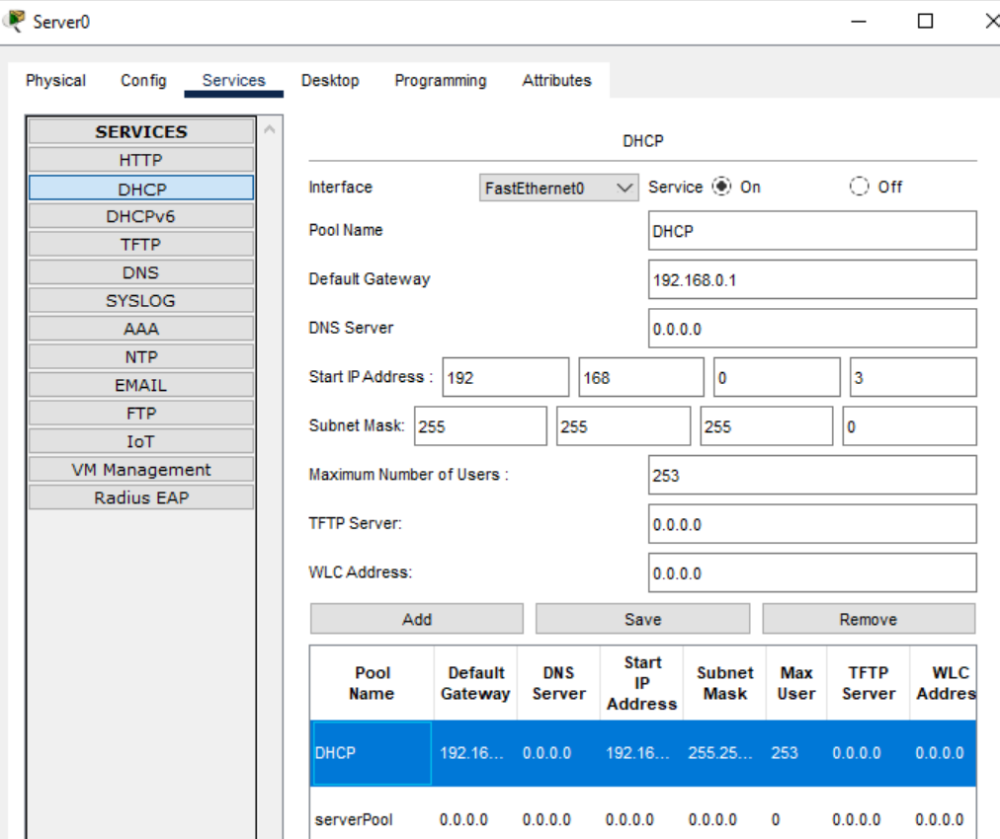

4. Configure the IP on the router as shown.

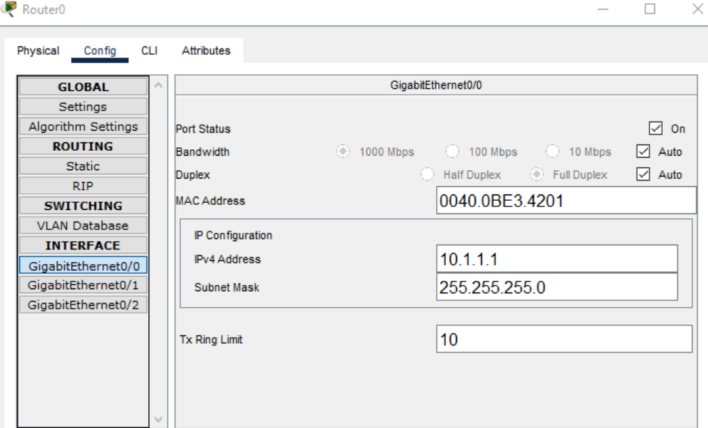

5. Enable DHCP to provide an automatic IP for PC0, PC1, and PC2.


### Securing the network

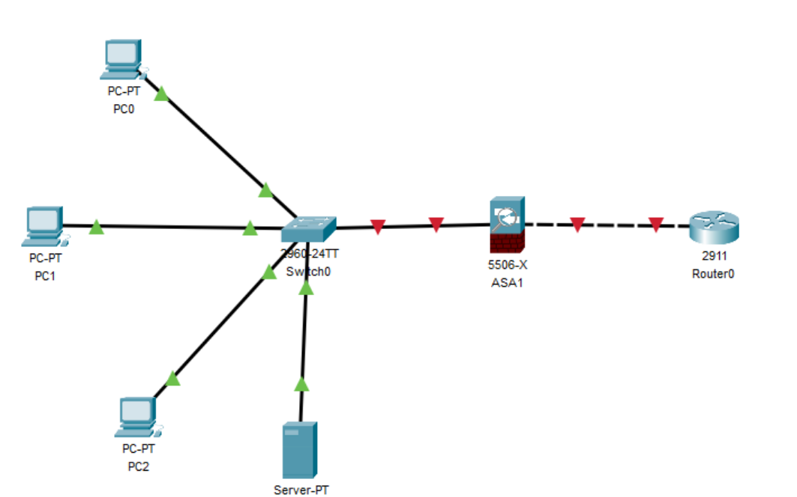

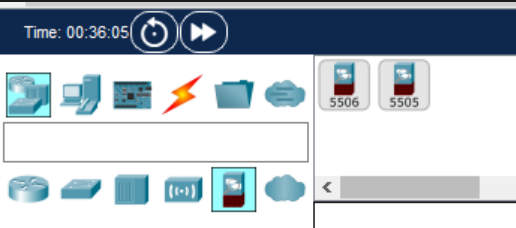

Now that the network is configured, we have to secure it from malicious actors. To do this, we can set up a basic firewall using an ASA device by first selecting the ASA 5506-X from the security devices and placing it between our switch and router. An ASA (Adaptive Security Appliance) device can function as a firewall, antivirus, intrusion prevention, and virtual private network (VPN). For this case, we will only be implementing a basic firewall.

Enter the CLI of the ASA and type `enable` and press enter when prompted for a password. Input the following commands to create an `inner` and `outer` network, setting different security levels to achieve our needs.

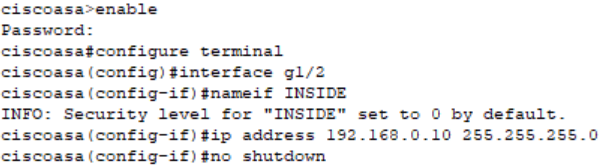

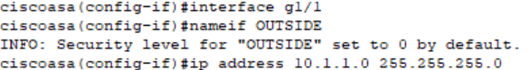

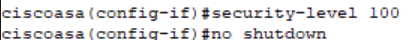

Now we are going to configure address translation using PAT and network objects.
To do this we need to create a network object INSIDE-NET and assign attributes to it using the subnet and nat commands.
Back in the CLI of the ASA input the following commands


```configure terminal```

```object network INSIDE-NET```

```subnet 192.168.1.0 255.255.255.0```

```nat (inside,outside) dynamic interface```

``exit``

```show run object network INSIDE-NET``` 


The ASA splits the configuration into the object portion that defines the network to be translated and the actual nat command parameters. These appear in two different places in the running configuration. Display the NAT object configuration using the `show run` command.

To test this, from `PC0` attempt to ping the `router G0/0` interface at IP address `10.1.1.1`. The pings should fail.

The ASA is a powerful tool and can be used to configure its own DHCP service and be remotely accessible. Configure AAA to use the local database for authentication. Define a local user named admin by entering the `username` command. Specify a password of the admin. Configure AAA to use the local ASA database for SSH user authentication.

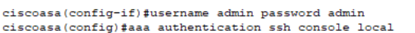

Configure remote access to the ASA. The ASA can be configured to accept connections from a single host or a range of hosts on the INSIDE or OUTSIDE network. In this step, hosts from the OUTSIDE network can only use SSH to communicate with the ASA. SSH sessions can be used to access the ASA from the inside network. Generate an RSA key pair, which is required to support SSH connections. Because the ASA device has RSA keys already in place, enter `no` when prompted to replace them.

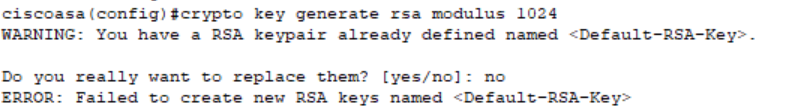

Configure the ASA to allow SSH connections from any host on the INSIDE network (192.168.0.10/24) and from (10.1.1.1) on the OUTSIDE network. Set the SSH timeout to 10 minutes (the default is 5 minutes).


The head to command prompt on PC0 and you should be able to ssh into the ASA server

```ssh -l admin 192.168.0.10```
 
And enter `admin` as the password we previously set when prompted.

This activity has demonstrated and hopefully taught you how to create a firewall and set the security level so it can be pinged by both inner and outer networks but only accessed by the inner network. 

My cookbook on Firewall Basics demonstrates a thorough understanding of the principles of networking security within CISCO packet tracer regarding firewalls.  I began by defining what a firewall does as a network security device and establishing its importance in protecting and securing networks from malicious intent. The lesson starts from the fundamentals with the network topology and configuring IP addresses and a DHCP service as well as routers to create a basic yet functional network. The initial setup takes into consideration users who may not have extensive knowledge of CISCO packet tracer and allows anyone to learn the lesson without any prior knowledge; this demonstrates and teaches basic network architecture design skills and comprehension of network systems. The cookbook then expands and teaches how to secure that network from external threats using an ASA (adaptive security appliance) device as a firewall. The decision to use an ASA device rather than a server as a firewall was because it is more complex and better in terms of security as it can be built upon to configure more security services using the same device. For simplicity and understanding, I chose to only use the firewall function of the ASA and simply implement DHCP using a server as that was not the focus of this lesson. In addition to this, I used the CLI (command line interface)to demonstrate further depth of understanding. To expand this, the additional functions of the ASA 5506-X such as its antivirus, intrusion prevention and VPN (virtual private network) services could be taught. Through the use of the CLI commands for the ASA configuration such as creating inside and outside networks with differing security levels and configuring address translation using PAT and network objects, a deeper level of understanding of firewall setup and management is communicated. In terms of novelty configuring the remote access to the ASA by building upon previous knowledge of SSH commands demonstrates the combination of operating system and packet tracer knowledge in a novel way. Instructions such as pinging throughout the interface to ensure secure remote access using authentication mechanisms demonstrate this.
